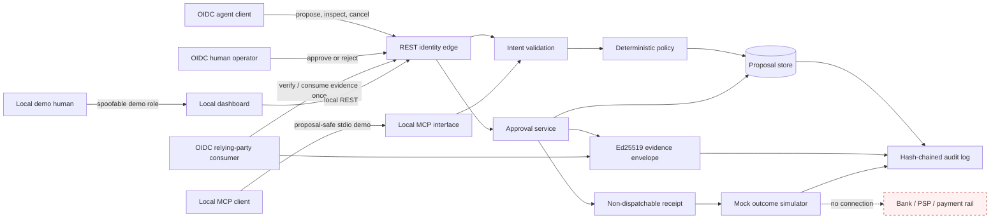
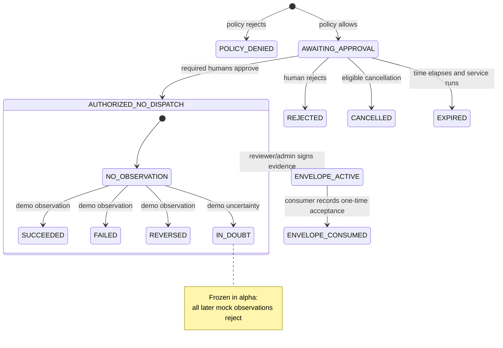

# Architecture

Parimit separates an untrusted agent-facing proposal plane from a
human-controlled decision plane. The shipped system ends at a mock simulator;
there is no live payment executor.

## Trust zones

| Zone | Trust | Allowed capabilities |
| --- | --- | --- |
| Agent / MCP client | Untrusted | Propose, read, and cancel eligible proposals; MCP remains a local process boundary |
| REST identity edge | Untrusted input | Verify OIDC bearer tokens or, only on an explicit local demo, accept spoofable headers |
| Domain and policy core | Trusted deterministic code | Validate and transition state; no network I/O |
| Human dashboard | Local demonstration surface | Spoofable demo identities exercise review flows; it is not part of the hosted OIDC pilot |
| Evidence consumer | Separate relying-party identity | Verify or atomically consume signed evidence; cannot browse proposals or issue envelopes |
| Store and audit log | Integrity-sensitive | Persist proposals and append events |
| Mock rail | Non-financial | Generate labelled demo outcomes only |
| Real provider | Out of scope | No connector exists in the default build |

## Core objects

**Payment proposal.** A request containing a generated identifier,
idempotency key, amount in minor units, ISO-style currency, payee reference,
purpose, timestamps, and policy context. Monetary values never use floating
point.

**Policy decision.** A deterministic result recording the rules and versions
that allowed, rejected, or escalated a proposal. New v3 proposals bind a digest
of the exact normalized deployment policy configuration, not only its human-
readable version label. A higher-risk proposal can require two distinct human
approvers.

**Approval.** An authenticated reviewer decision bound to the v3 digest of immutable
proposal inputs and the initial policy decision. The integrity verifier also
cross-checks later decisions and lifecycle state against the local event
history before returning an authorization receipt.

**Authorization receipt.** Evidence that policy and human decision conditions
were met. It is intentionally not shaped like a provider payment instruction
and has no dispatch method.

**Authorization Envelope v1.** A compact Ed25519 JWS issued only for a fully
approved, unexpired v3 proposal. It binds tenant, relying-party audience,
identity trust domain, intent/policy digests and policy-configuration digest,
authorization-state version, exact approver set, exact issuance time, short
expiry, nonce and the pre-issuance audit tip. Its signed capability is evidence-
only and explicitly forbids payment dispatch or value movement.

**Envelope consumption.** A mutable record outside the signed JWS. One
consumer/idempotency operation may atomically transition it from `UNCONSUMED`
to `CONSUMED`; every different replay fails. This is an evidence-acceptance
record, not payment execution.

**Audit event.** A local record containing the previous event hash. Application
code appends events, but SQLite does not enforce append-only storage. The chain
detects isolated rewriting; it does not replace durable, externally anchored
audit storage.

## State model

Terminal and exact names in the implementation are authoritative. No state in
this diagram means that funds were transferred. Other mock outcomes may be
replaced by a later mock outcome, but `IN_DOUBT` is fail-closed: after it is
recorded, the alpha rejects every later observation and exposes no
reconciliation mechanism.

## Process boundaries

The HTTP server serves the local dashboard and REST API. The MCP process communicates
over standard input/output so protocol data is not mixed with ordinary logs;
it is disabled in OIDC mode because alpha.3 has no verified actor binding for
stdio MCP.
Both call the same proposal-oriented application services. Envelope issuance
and consumption remain REST/SDK-only and are absent from MCP. Domain and policy
modules do not import networking modules; the CI boundary scanner enforces that
constraint statically.

The alpha.3 HTTP edge can verify OIDC identity and fail closed on role mapping.
New intents bind a single configured tenant, but the shipped runtime does not
route multiple tenants and remains SQLite-backed. The
PostgreSQL schema and transaction contract under `db/postgres/` are an
integration track, not a runtime selector. Multi-tenancy, managed key custody,
live PostgreSQL parity, rate limiting, and external audit anchoring are still
deliberately not implied.

## Source provenance

This architecture is independently implemented. Its safety separation was
informed by NPCI AiNxt OS's public payment boundary at commit
[`5b6fbb90eb715384559256f7257e4d661cb1d17b`](https://github.com/NPCI/ainxt-os/tree/5b6fbb90eb715384559256f7257e4d661cb1d17b).
No AiNxt source code was copied into the initial implementation.
